# BLUEPRINT: Next.js Landing Page Integration

This document outlines the technical architecture for integrating a public-facing Next.js landing page with the existing KasirGrafity POS system using Supabase as the bridge.

## 1. Architecture Overview

**Flow:** Customer (Public Web) -> Next.js -> Supabase (`web_order_inbox`) -> Realtime Event -> POS Client (Admin/Owner).

```mermaid
sequenceDiagram
    participant Customer
    participant NextJS as Next.js Landing Page
    participant Supabase as Supabase DB
    participant POS as POS Client (Admin)

    Customer->>NextJS: Submits Order Form
    NextJS->>Supabase: INSERT into 'web_order_inbox'
    Supabase-->>POS: Realtime Event (INSERT)
    POS->>POS: Show Notification Badge 🔔
    POS->>POS: Admin Reviews & Approves
    POS->>Supabase: Move to 'orders' table
```



## 2. Database Schema Specification

Create a new table `web_order_inbox` to act as a holding area for incoming web orders.

| Column Name        | Type          | Default             | Description                        |
| ------------------ | ------------- | ------------------- | ---------------------------------- |
| `id`               | `uuid`        | `gen_random_uuid()` | Primary Key                        |
| `created_at`       | `timestamptz` | `now()`             | Timestamp of submission            |
| `customer_name`    | `text`        | -                   | Name of the customer               |
| `customer_contact` | `text`        | -                   | WhatsApp/Email                     |
| `order_details`    | `jsonb`       | `{}`                | JSON details (items, notes, files) |
| `status`           | `text`        | `'PENDING'`         | PENDING, PROCESSED, REJECTED       |
| `is_read`          | `boolean`     | `false`             | Read status for notification       |

## 3. Security Protocols (RLS)

**CRITICAL:** Only allow public users (anon) to INSERT. They must NOT be able to read or modify other orders.

```sql
-- Enable RLS
ALTER TABLE web_order_inbox ENABLE ROW LEVEL SECURITY;

-- Policy 1: Public Insert (Anon)
CREATE POLICY "Public can insert orders"
ON web_order_inbox
FOR INSERT
TO anon
WITH CHECK (true);

-- Policy 2: Staff Full Access (Authenticated)
CREATE POLICY "Staff can manage inbox"
ON web_order_inbox
FOR ALL
TO authenticated
USING (true)
WITH CHECK (true);
```

## 4. Implementation Guide (Next.js Side)

**Initialize Supabase Client (`lib/supabaseClient.js`):**

```javascript
import { createClient } from "@supabase/supabase-js";

const supabaseUrl = process.env.NEXT_PUBLIC_SUPABASE_URL;
const supabaseAnonKey = process.env.NEXT_PUBLIC_SUPABASE_ANON_KEY;

export const supabase = createClient(supabaseUrl, supabaseAnonKey);
```

**Submit Order Function:**

```javascript
async function submitWebOrder(formData) {
  const { data, error } = await supabase
    .from("web_order_inbox")
    .insert([
      {
        customer_name: formData.name,
        customer_contact: formData.whatsapp,
        order_details: {
          items: formData.items,
          notes: formData.notes,
        },
        status: "PENDING",
      },
    ])
    .select();

  if (error) {
    console.error("Error submitting order:", error);
    return false;
  }
  return true;
}
```

## 5. Implementation Guide (POS Side)

**Subscribe to Realtime Events:**
Use this in a global component (e.g., `Layout.jsx` or `NotificationProvider.jsx`).

```javascript
import { useEffect } from "react";
import { supabase } from "../services/supabaseClient";
import { useNotificationStore } from "../stores/useNotificationStore";

export function InboxListener() {
  const addNotification = useNotificationStore(
    (state) => state.addNotification,
  );

  useEffect(() => {
    const channel = supabase
      .channel("public:web_order_inbox")
      .on(
        "postgres_changes",
        { event: "INSERT", schema: "public", table: "web_order_inbox" },
        (payload) => {
          console.log("New Web Order!", payload);
          addNotification({
            title: "New Web Order",
            message: `Order from ${payload.new.customer_name}`,
            type: "info",
          });
        },
      )
      .subscribe();

    return () => {
      supabase.removeChannel(channel);
    };
  }, []);

  return null;
}
```
