# Laporan Diagnosis: Kegagalan Jejak Audit (Audit Trail)

**Tanggal:** 16 Februari 2026
**Topik:** Mengapa Jejak Audit tidak muncul & Nama CS tidak terekam.
**Status Audit:** 🔍 Selesai (Read-Only)

---

## 1. Ringkasan Temuan (Executive Summary)

Sistem Audit Trail saat ini mengalami **pemutusan rantai data** (Data Disconnect) di dua titik krusial:

1.  **Masalah Identitas (ID Mismatch):** Log direkam menggunakan **Local ID** (sementara), namun saat dilihat di UI, sistem mencari menggunakan **Server UUID** (permanen). Karena tidak ada jembatan di antara keduanya saat _query_, hasil pencarian kosong.
2.  **Masalah Nama CS (Hardcoded):** Log pembuatan order secara eksplisit diprogram untuk menuliskan "System" sebagai pelakunya, mengabaikan data CS yang sebenarnya sedang login.

---

## 2. Detail Diagnosis Teknis

### A. Mengapa "Jejak Audit" Kosong? (The ID Problem)

Alur yang terjadi saat ini:

1.  **Pencatatan Awal (Optimistic UI):**
    - Saat tombol "Bayar" ditekan, `useOrderStore.js` membuat ID Lokal sementara (contoh: `local_174000...`).
    - Log audit dibuat detik itu juga menggunakan ID Lokal tersebut.
    - **Data di Tabel `event_logs`:**
      - `ref_id` = `local_174000...`
      - `metadata.ref_local_id` = `local_174000...`

2.  **Sinkronisasi ke Server (Sync):**
    - `OrderSyncService` mengirim data ke Supabase.
    - Supabase memberikan ID baru berupa UUID (contoh: `550e8400-e29b...`).
    - Aplikasi di-refresh, order sekarang dikenali dengan UUID `550e8400...`.

3.  **Saat Anda Membuka Modal "Jejak Audit":**
    - Modal (`AuditLogModal.jsx`) menerima ID Order saat ini: `550e8400...` (UUID).
    - Modal mencoba mencari di database dengan logika:
      > _"Cari log yang `ref_id` = `550e8400...` ATAU `ref_local_id` = `550e8400...`"_
    - **HASIL:** Kosong. Karena log yang tersimpan masih memegang ID `local_174000...`. Log tersebut menjadi "yatim piatu" (orphaned) karena tidak tahu bahwa `local_174000...` sekarang sudah berubah menjadi `550e8400...`.

**Rekomendasi Perbaikan (Tanpa Coding Sekarang):**
UI `AuditLogModal` perlu diubah agar mencari berdasarkan `ref_local_id` jika tersedia di data order, bukan hanya mengandalkan UUID.

---

### B. Mengapa Nama CS Tidak Muncul? (The Hardcoded Problem)

Saat order dibuat, sistem sebenarnya memiliki data **CS** yang login (misal: "Budi"). Namun, kode yang bertugas mencatat log ini mengabaikannya.

**Lokasi Kesalahan:** `src/stores/useOrderStore.js` (Baris 1006)

```javascript
// KODE SAAT INI:
await logPOSOrderCreated(localOrderId, "System");

// MASALAH:
// Parameter ke-2 adalah string hardcoded "System".
// Ini menyebabkan semua order terlihat dibuat oleh "System".
```

Padahal data user tersedia di variabel `currentUser` yang dikirim dari `Workspace.jsx` ke `finalizeOrder`.

---

## 3. Alur Data (Flowchart Diagnosis)

```mermaid
graph TD
    A[POS Checkout] -->|Input Nama CS: 'Budi'| B(Finalize Order)
    B -->|Generate Local ID: 'local_123'| C{Create Log?}

    C -->|⛔ ERROR 1: Hardcoded| D[Log: Created by 'System']
    C -->|Local ID| E[Log: Ref ID = 'local_123']

    B -->|Sync to Server| F[Supabase: Order ID = 'uuid_999']

    G[User Buka Audit Modal] -->|Pass ID: 'uuid_999'| H{Query DB}
    H -->|Cari 'uuid_999' di Logs?| I[❌ TIDAK KETEMU]
    I --> J[Tampilan: 'Belum ada aktivitas']

    style D fill:#fca5a5,stroke:#b91c1c
    style I fill:#fca5a5,stroke:#b91c1c
```



## 4. Kesimpulan

Jejak audit tidak berfungsi bukan karena rusak parah, tetapi karena dua _glitch_ logika spesifik:

1.  **Pencarian Log** menggunakan ID yang salah (UUID vs Local ID).
2.  **Pencatatan Aktor** dipaksa menjadi "System".

Laporan ini dibuat murni hasil pembacaan kode (Forensik) tanpa melakukan perubahan baris kode apa pun.
